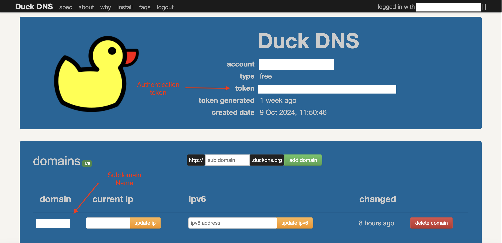
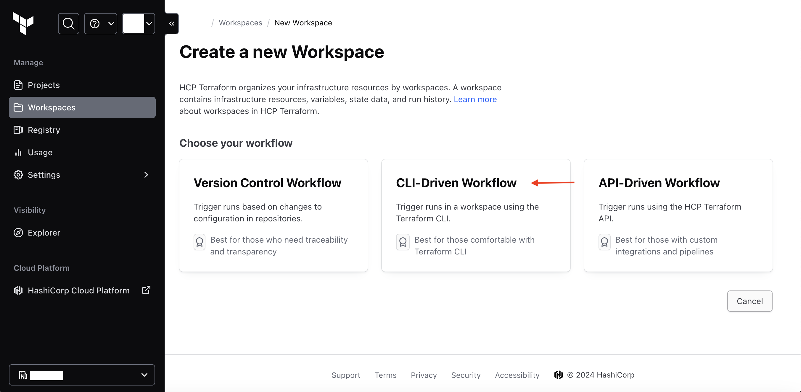
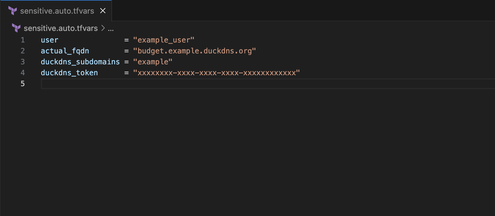
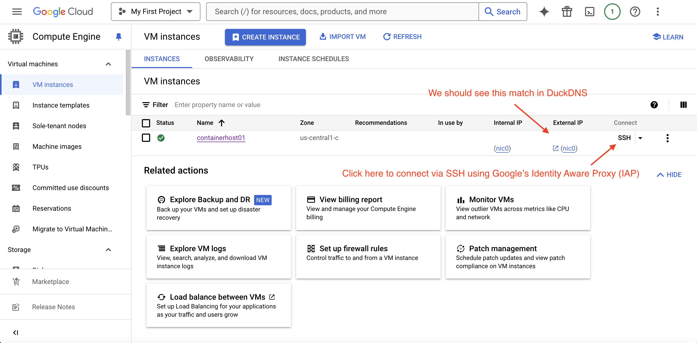
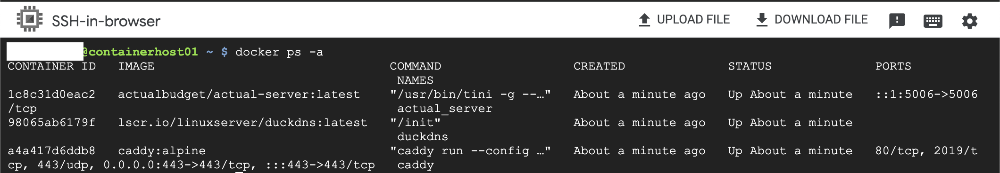
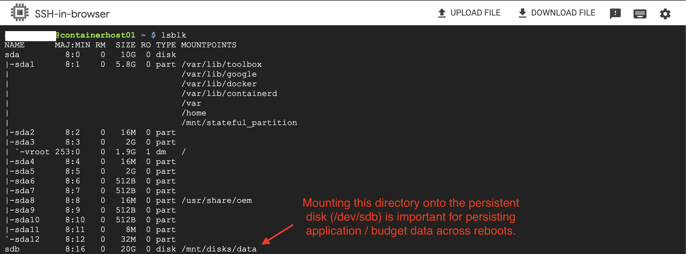
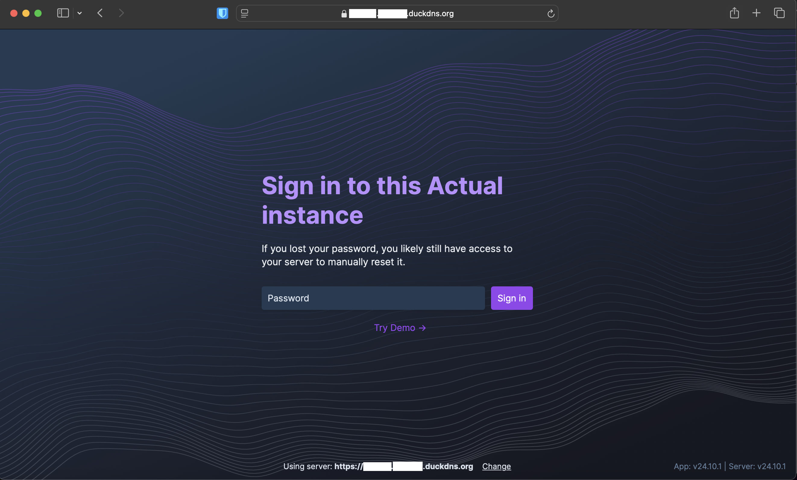

# actual-gcp
Actual Budget hosted on Google Cloud's always free tier

## Background
The goal of this repository is to deploy [Actual Budget][1] running on [Google Cloud's][2] [Free Tier][3], using the Compute Engine service. This setup utilizes [Terraform][4] to deploy and automatically configure the cloud infrastructure. Some manual steps may still need to be taken, but I've tried to remove as many as possible and document the rest.

Some notes about the architecture of this setup:

* The Compute Engine instance is deployed using Google's [Container Optimized OS][5] image and the applications run within this instance using [Docker][6].
* [DuckDNS][7] is used to provide a free subdomain for DNS resolution. If you own your own domain, you should be able to still use most of this configuration, though changes would need to be made. What those changes are have not been vetted or tested by me, and are outside the scope of this documentation.
* [Caddy][8] is used as a reverse proxy and for automatic TLS certificate management.
* [Terraform state][9] management is being handled by [HCP Terraform (formerly Terraform Cloud)][10], though you could opt to store your state file elsewhere if you want to (and feel comfortable doing so). Doing so is outside the scope of this documentation.

**Disclaimer**: While I've attempted to ensure that all cloud infrastructure being deployed is part of GCP's free tier, you are ultimately responsible for your own cloud spend. The Terraform code sets up an adjustible monthly billing alert to help mitigate risk of unexpected cloud costs, but it is your responsibility to monitor your cloud account.

[1]: https://actualbudget.com/
[2]: https://cloud.google.com
[3]: https://cloud.google.com/free/docs/free-cloud-features?_gl=1*16i0xkv*_up*MQ..&gclid=EAIaIQobChMItuHQrcyPiQMVFUL_AR2RuhIpEAAYASAAEgKEkPD_BwE&gclsrc=aw.ds#free-tier-usage-limits
[4]: https://www.terraform.io
[5]: https://cloud.google.com/container-optimized-os/docs
[6]: https://www.docker.com
[7]: https://www.duckdns.org/
[8]: https://caddyserver.com/
[9]: https://developer.hashicorp.com/terraform/language/state
[10]: https://app.terraform.io
[11]: https://cloud.google.com/sdk/docs/install
[12]: https://developer.hashicorp.com/terraform/install
[13]: https://cloud.google.com/architecture/best-practices-vpc-design#custom-mode
[14]: https://developer.hashicorp.com/terraform/tutorials/cloud-get-started/cloud-login
[15]: https://git-scm.com/downloads/win
[16]: https://cloud.google.com/billing/docs/resources/currency#list_of_countries_and_regions
[17]: https://actualbudget.com/docs/overview/getting-started/

## Pre-requisites
* A [Google Cloud][2] account
* A free [HCP Terraform][10] account (unless you want to host your state locally or elsewhere)
* A free [DuckDNS][7] subdomain
* The [Google Cloud CLI][11] tools installed
* [Terraform][12] installed

## Instructions
1. If you haven't already, create your [DuckDNS][7] subdomain and make note of your authentication token.
    * 
2. If you haven't already, create your organization, project (unless you're using the Default project), and workspace in [HCP Terraform][10]. This repository assumes you've created your workspace using the CLI-Driven Workflow, but you can choose one of the other methods if you're comfortable adapting the instructions to accommodate it.
    * 
3. *Optional* - Run the following command to create an SSH public/private key-pair (if on Windows, you may need to [install Git][15] first):
    * `ssh-keygen`
    * **Note** - This will be used for SSH key-pair authentication when connecting directly, without the use of the Google SSH proxy. This configuration disables direct SSH access by default, though a firewall rule does get created to allow it. It is included in case short-term "break glass" / emergency access is needed.
4. Clone this repository to your machine (or create a fork and clone your fork) and open a terminal session into the repository's directory.
5. Run the following command to initialize your Google Cloud command line tools: 
    * `gcloud init`
6. Run the following command to make your user credentials available to Application Default Credentials (ADC):
    * `gcloud auth application-default login`
7. Run the following command to enable the API services necessary for Terraform to run and configure the rest of the environment:
    * `gcloud services enable cloudresourcemanager.googleapis.com`
8. If this is a new Google Cloud environment, I recommend running the following commands to delete the default networking configuration, as new configurations will be deployed via Terraform:
    * `gcloud compute firewall-rules list`
    * For each firewall rule listed, run `gcloud compute firewall-rules delete rulename`
    * `gcloud compute networks delete default`
    * If you already have resources active using the default VPC, skip this step and update the Terraform code to remove the new 'google_compute_network' and 'google_compute_route' resources, as well as modifying the network for the 'google_compute_firewall' and 'google_compute_instance' resources.
    * Deleting the default network and using a custom network helps align with [documented best-practices regarding VPC design][13].
9. We're now ready to begin configuring our local Terraform environment. Run the following command to [authenticate with HCP Terraform][14]:
    * `terraform login`
10. Make the following updates to the following files in the repository:
    * Update `backend.tf` with your organization and workspace names from HCP Terraform.
    * Update `main.tf` with your GCP project name for the "project" and "billing_project" parameters. You may have the same value for the "project" and "billing_project" parameters. You can optionally change the region and zone as well, but keep in mind [only certain regions are eligible for the always-free Compute Engine instance][3].
    * Create a file named `sensitive.auto.tfvars` and create the following variables:
        * actual_fqdn - The fully-qualified domain name you want to use for your Actual Budget server. This can either be the same value as your DuckDNS subdomain (i.e. "example.duckdns.org"), or a subsite within it (i.e. "budget.example.duckdns.org")
        * billing_account_name = "your_billing_account_name" - This defaults to "My Billing Account", so this only needs defined if your billing account name is something else.
            * If you're not sure what your billing account name is, run the following command to list your billing accounts:
                `gcloud billing accounts list`
        * billing_alert_currency_code = "[your_currency_code][16]" - This isn't really a sensitive variable, but to simplify things, we can put it in the same ".auto.tfvars" file. This defaults to "USD", so this only needs defined if you're using a different currency.
        * billing_alert_amount = "the_amount_you_want" - This isn't really a sensitive variable, but to simply things, we can put it in the same ".auto.tfvars" file. This defaults to "5", so this only needs defined if you want to set a different billing alert threshold.
        * duckdns_subdomains = "your_subdomain" - Values captured in Step #1.
        * duckdns_token = "your_duckdns_token" - Values captured in Step #1.
        * public_key_path - The path on your local machine to the SSH public key that was generated in Step #2 (if it was named something other than the default value defined in `compute-variables.tf`)
        * user = "your_google_username" - It should be your Google username without the "@gmail.com". If you use the SSH proxy to login from the GCP console, it will log you in automatically as this user.
        * **Note** - The `.gitignore` file is configured to ignore any *.auto.tfvars files. Be extremely cautious with what variable values you allow to be pushed to your source control (Git) repository.
        * **Note** - You could also define these variables within HCP Terraform if you want to have your Terraform actions performed there instead of your local command line.
        * 
11. Run the following command to initiate Terraform:
    *  `terraform init`
12. Run the following command to execute a "plan" operation, where we can inspect what Terraform operations are expected to happen when the "apply" operation happens:
    *  `terraform plan`
13. Once you've reviewed the output of the "plan" operation and are ready to deploy the infrastructure, run the following command and confirm when prompted:
    * `terraform apply`
14. *Optional* - Post-deployment validation:
    * Once the "apply" operation has completed, navigate to the Google Cloud web console and inspect the new virtual machine.
        * 
    * **Note** - You can also run the following Google Cloud command to validate the new virtual machine:
        * `gcloud compute instances list`
        * `gcloud compute instances describe containerhost01`
    * **Note** - If you login to your DuckDNS account, you should see the IP address for your subdomain has been updated with the public IP address of your virtual machine.
    * Click the SSH button in the Google Cloud console. Once connected, run `docker ps -a`. We should see three containers running:
        * 
        * If the Google Cloud SSH proxy isn't working, temporarily update the "container_host_network_tags" variable in `terraform.tfvars` and re-run `terraform apply` to add the "allow-ssh" tag, which will allow SSH from your local machine. I recommend removing that network tag and re-running `terraform apply` when finished to disable direct SSH access again.
    * If the three containers aren't running, you can inspect their associated systemctl services using the following commands:
        * `systemctl status actual`
        * `systemctl status caddy`
        * `systemctl status duckdns`
    * If the containers are running, but things aren't working as-expected, use the following commands to inspect the container logs to further troubleshoot:
        * `docker logs actual_server`
        * `docker logs caddy`
        * `docker logs duckdns`
    * Run the following command to ensure the applications' "data" directory has been mounted onto the Persistent Disk (/dev/sdb):
        * 
        * **Important** This part of the configuration is critical to application data persisting across virtual machine reboots.
16. Open your web browser and navigate to the fully-qualified domain name you set for the value of the "actual_fqdn" variable (i.e. https://budget.example.duckdns.org). You should see the Actual Budget login page. You're now ready to setup your budget. Follow [Actual Budget's Getting Started][17] page for next steps.
    * 

